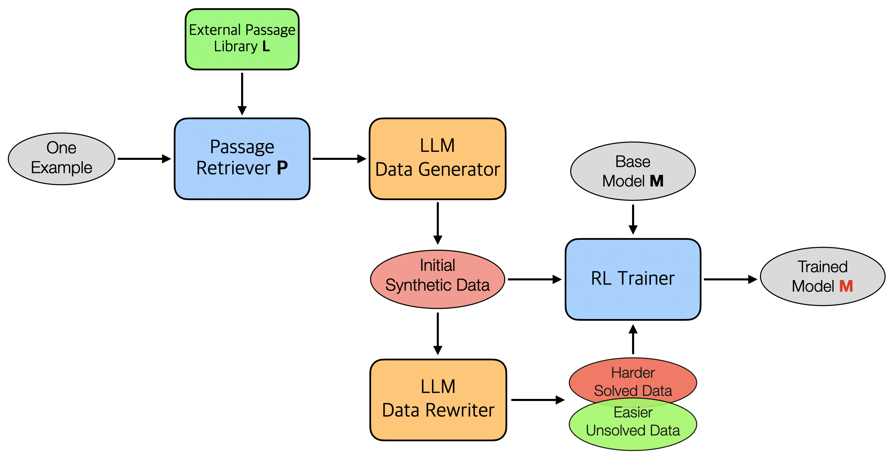
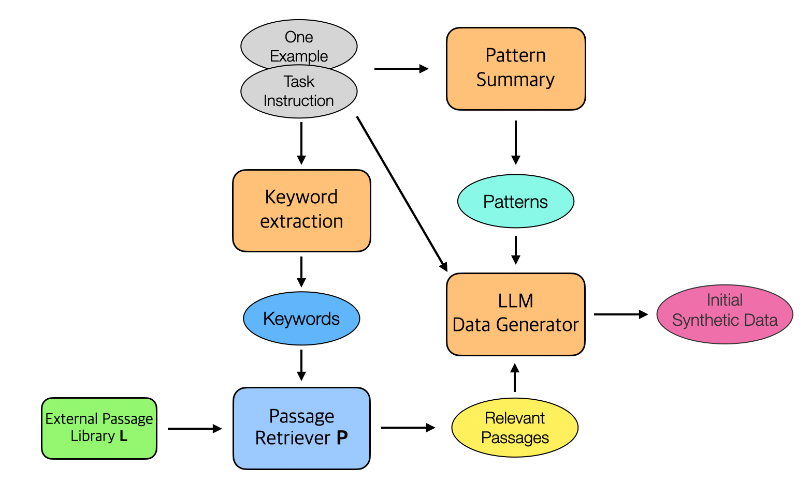
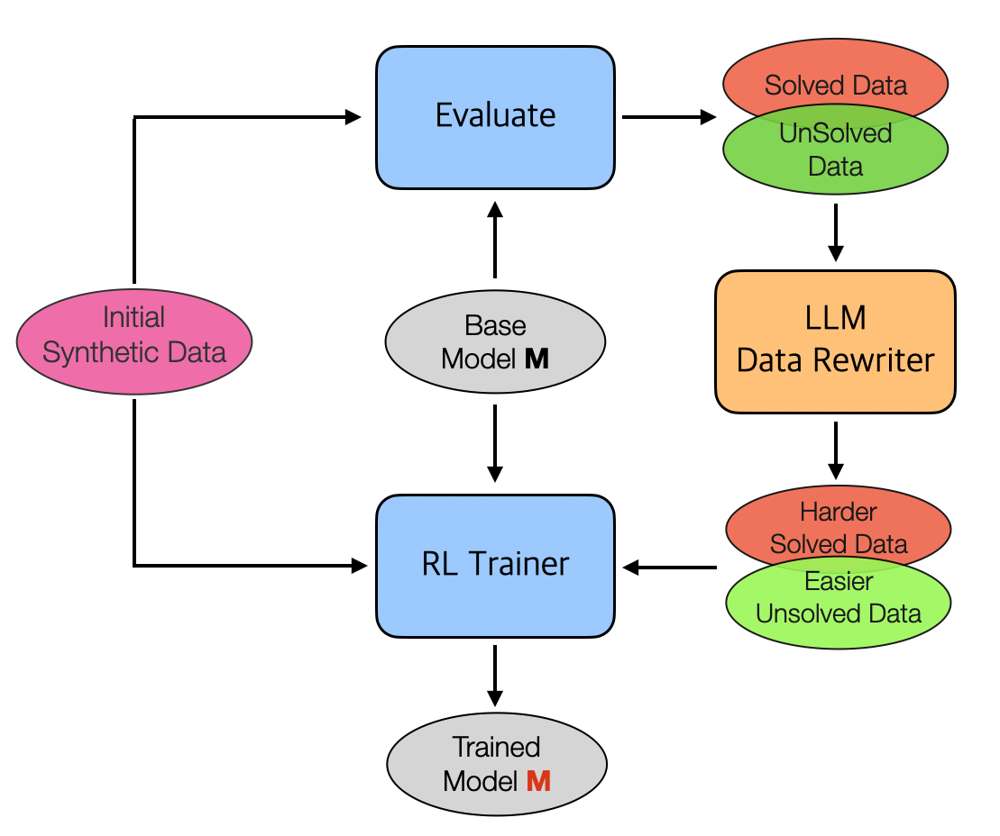

# 🚀 Data-Synthesis-RL: Efficient Few-Shot RL Fine-Tuning with Synthetic Data Generation

[](https://www.python.org/downloads/release/python-3100/)
[](LICENSE)

## 💡 Introduction



This project implements an efficient approach for fine-tuning a base language model ($\mathcal{M}_{base}$) when only task instructions and a few demonstration examples $\mathcal{D}$ (optional) are available. It leverages a powerful teacher large language model ($\mathcal{T}$), external knowledge retrieval, and strategic synthetic data generation to create an effective training dataset. The base model is then trained on the most informative subset of this synthetic data using reinforcement learning.

## 🛠️ Components

The system utilizes four key components:

1. **🔍 Passage Retriever ($\mathcal{P}$)**:
   * Takes keywords (extracted from the task instruction $\mathcal{I}$ and demos $\mathcal{D}$ using the teacher model $\mathcal{T}$) as input.
   * Searches a large text library ($\mathcal{L}$, e.g., Wikipedia) to find relevant passages ($\mathcal{R}$) that provide external context.

2. **📊 LLM Data Generator ($\text{LLM}_{generator}$)**:
   * Uses the teacher model ($\mathcal{T}$) to synthesize new training data ($\mathcal{S}_{initial}$).
   * Takes task instructions ($\mathcal{I}$), summarized sample patterns ($P$), demonstration examples ($\mathcal{D}$), and retrieved passages ($\mathcal{R}$) as input.
   * Incorporates a verification step (e.g., majority voting) to ensure data quality.

3. **✍️ LLM Data Re-writer ($\text{LLM}_{writer}$)**:
   * Also uses the teacher model ($\mathcal{T}$).
   * Takes existing synthetic samples and modifies them to be either harder ($\mathcal{S}\_{harder}$) or easier ($\mathcal{S}_{easier}$) based on the base model's performance.
   * Includes a verification step to filter low-quality outputs.

4. **📈 Trainer ($T$)**:
   * Implements a reinforcement learning algorithm.
   * Trains the base model ($\mathcal{M}_{base}$) specifically on a selected subset of high-potential synthetic samples.

## ⚙️ Workflow

<table>
<tr>
<td></td>
<td></td>
</tr>
</table>

Given a base model ($\mathcal{M}_{base}$), task instruction ($\mathcal{I}$), and a few demonstration examples ($\mathcal{D}$), the training process involves four main steps:

1. **Keyword Extraction and Passage Retrieval**:
   * The teacher model $\mathcal{T}$ extracts domain-specific keywords ($\mathcal{K}$) from $\mathcal{D}$ and $\mathcal{I}$.
   * The Passage Retriever $\mathcal{P}$ uses $\mathcal{K}$ to fetch relevant passages $\mathcal{R}$ from the library $\mathcal{L}$.

2. **Sample Pattern Summarization and Initial Data Generation**:
   * The teacher model $\mathcal{T}$ summarizes the underlying pattern ($P$) from the demonstration examples $\mathcal{D}$.
   * The $\text{LLM}\_{generator}$ creates an initial set of $N$ synthetic samples ($\mathcal{S}_{initial}$) using $\mathcal{R}$, $P \cup \mathcal{D}$, and $\mathcal{I}$.

3. **Difficulty-Adaptive Sample Generation**:
   * The base model $\mathcal{M}\_{base}$ attempts to solve the samples in $\mathcal{S}_{initial}$.
   * Samples are split into solved ($\mathcal{S}\_{solved}$) and unsolved ($\mathcal{S}_{unsolved}$) sets.
   * The $\text{LLM}\_{writer}$ generates harder samples ($\mathcal{S}\_{harder}$) from $\mathcal{S}\_{solved}$ and easier samples ($\mathcal{S}\_{easier}$) from $\mathcal{S}_{unsolved}$.
   * All generated samples are combined: $\mathcal{S}\_{synth} = \mathcal{S}\_{initial} \cup \mathcal{S}\_{harder} \cup \mathcal{S}\_{easier}$.

4. **Training with High-Potential Samples**:
   * Each sample $s \in \mathcal{S}_{synth}$ is scored based on the base model's consistency in solving it. Lower scores indicate inconsistency (higher potential).
   * The top $M$ samples with the lowest scores (those the model can solve occasionally but not always, or never solves) are selected.
   * The Trainer $T$ fine-tunes $\mathcal{M}\_{base}$ on this selected subset using reinforcement learning, resulting in the final trained model $\mathcal{M}_{trained}$.

## 🚀 Getting Started

### 1. Create and activate a virtual environment

```bash
conda create -n data_rl python=3.10
conda activate data_rl
```

### 2. Install related libraries

```bash
sh activate.sh
```

### 3. Configure OpenAI Key

Place your OpenAI key in `model_inference/openai_call.py`

### 4. Create Your Task-Specific Evaluation Folder

Create a new directory for your task within `src/eval/tasks/`. This folder handles task-specific logic for the data generation and evaluation process and must include the following five Python scripts:

* `process_label.py`: Extracts the ground truth label from the human-labeled output of a test sample.
* `process_prediction.py`: Extracts the model's prediction from its full response to a test sample.
* `eval_function.py`: Compares the extracted prediction with the ground truth label.
* `get_output_instruction.py`: Provides the specific output format instruction for the model.
* `process_and_save_dataset.py`: Transforms raw training data into the format required for RL training.

### 5. Define the Reward Function for RL Training

1. Create a new Python file (e.g., `your_task_reward.py`) in `verl/utils/reward_score/`
2. Implement scoring logic considering format and result scores
3. Register the function in `verl/trainer/main_ppo.py`

### 6. Prepare Passage Libraries for Retrieval

Place your text corpora in the `src/retriever/passages/` directory. You can use:
- Standard corpora (e.g., Wikipedia, Wikihow, StackExchange)
- Custom corpora in `.jsonl` format

### 7. Configure Demonstration Examples

Set your input/output examples in `src/main.py` using the format:
```python
[
    {'input': 'Your example input', 'output': 'Your example output'},
    # Add more examples as needed
]
```

### 8. Running an Experiment

```bash
export CUDA_VISIBLE_DEVICES=0,1,2,3,4

python src/main.py \
    --base_model_path ./src/model/Qwen2.5-7B \
    --task_name your_task \
    --task_instruction 'Your task instruction' \
    --dataset_path './src/data_your_task' \
    --work_model_paths './TinyZero/checkpoints/TinyZero'
```

## 📝 License

This project is licensed under the Apache 2.0 License - see the [LICENSE](LICENSE) file for details.

## 🙏 Acknowledgements

- [Qwen](https://github.com/QwenLM/Qwen) for the base model
- [TinyZero](https://github.com/Jiayi-Pan/TinyZero) for the training framework
- [veRL](https://github.com/volcengine/verl) for the reinforcement learning framework
- All contributors and users of this project

## 📚 Citation

If you find our work helpful, please consider citing:

```bibtex
@misc{data-synthesis-rl,
  title={Data-Synthesis-RL: Efficient Few-Shot RL Fine-Tuning with Synthetic Data Generation},
  author={},
  howpublished={\url{https://github.com/your-username/Data_Synthesis_RL}},
  year={2024}
}
```
