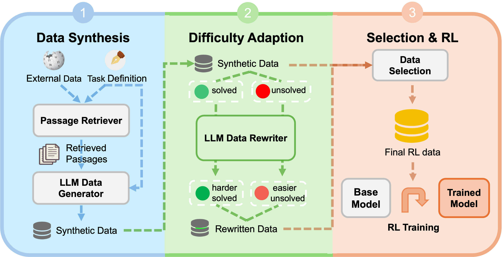
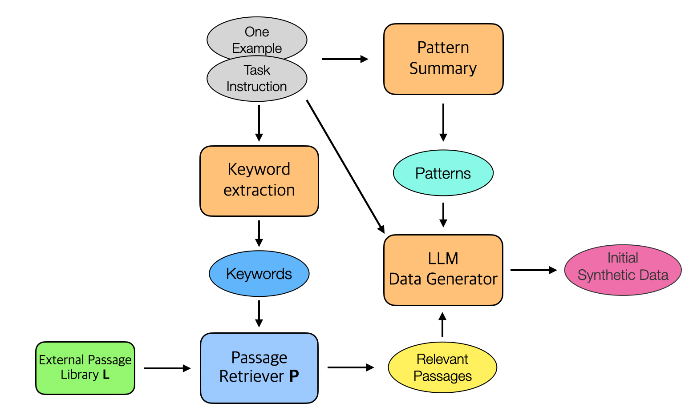
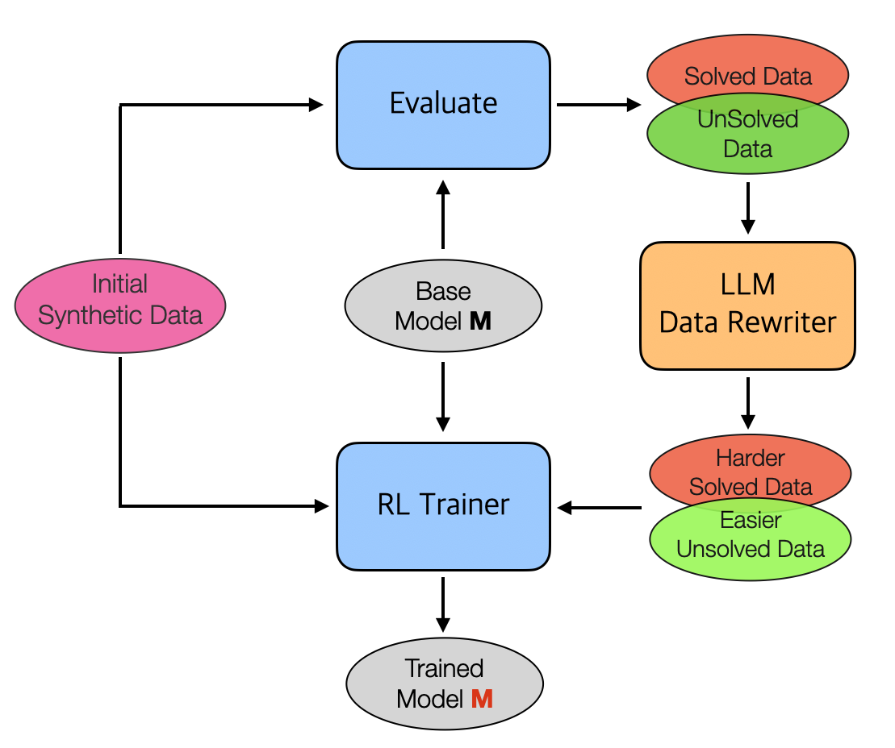

# 🚀 Synthetic Data RL: One Task Definition Is All You Need

[](https://www.python.org/downloads/release/python-3100/)
[](LICENSE)

## 💡 Overview



**Synthetic Data RL** fine-tunes language models using only synthetic data generated from a task definition. No human-labeled data required.

**Key Results on Qwen-2.5-7B:**
- GSM8K: 91.7% (+29.2% over base model)
- MATH: 72.0% (+8.7%)
- GPQA: 73.1% (+13.1%)
- MedQA: 64.5% (+8.9%)
- CQA (law): 92.4% (+17.7%)
- CFA (finance): 73.2% (+13.7%)

## 🛠️ How It Works

The system has 4 components:

1. **Passage Retriever**: Finds relevant text from Wikipedia/other sources
2. **Data Generator**: Creates synthetic training examples using GPT-4
3. **Data Re-writer**: Adjusts difficulty based on model performance
4. **RL Trainer**: Fine-tunes the model on high-potential samples

## ⚙️ Process

<table>
<tr>
<td></td>
<td></td>
</tr>
</table>

1. **Extract keywords** from task definition → Retrieve relevant passages
2. **Generate synthetic data** using task patterns and retrieved knowledge
3. **Adjust difficulty**: Make harder/easier versions based on what model can solve
4. **Train with RL** on samples where model shows partial understanding

## 🚀 Quick Start

### 1. Setup Environment

```bash
conda create -n data_rl python=3.10
conda activate data_rl
sh activate.sh
```

### 2. Configure API Keys

- OpenAI key → `model_inference/openai_call.py`
- Wandb key → `TinyZero/train_RL_base.sh`

### 3. Create Task Folder

Add these files to `src/eval/tasks/your_task/`:
- `process_label.py` - Extract ground truth
- `process_prediction.py` - Extract model prediction
- `eval_function.py` - Compare predictions
- `get_output_instruction.py` - Output format
- `get_input_instruction.py` - Input format
- `process_and_save_dataset.py` - Data processing

### 4. Define Reward Function

Create reward function in `verl/utils/reward_score/` and register in `verl/trainer/main_ppo.py`

### 5. Add Text Corpus

Place retrieval documents in `src/retriever/passages/`

### 6. Set Examples

Configure demo examples in `src/main.py`:
```python
[{'input': 'example input', 'output': 'example output'}]
```

### 7. Run Training

```bash
export CUDA_VISIBLE_DEVICES=0,1,2,3,4

python src/main.py \
    --base_model_path ./src/model/Qwen2.5-7B \
    --task_name your_task \
    --task_instruction 'Your task instruction' \
    --dataset_path './src/data_your_task' \
    --work_model_paths './TinyZero/checkpoints/TinyZero'
```

## 📝 Citation

```bibtex
@misc{guo2025syntheticdatarltask,
      title={Synthetic Data RL: Task Definition Is All You Need}, 
      author={Yiduo Guo and Zhen Guo and Chuanwei Huang and Zi-Ang Wang and Zekai Zhang and Haofei Yu and Huishuai Zhang and Yikang Shen},
      year={2025},
      eprint={2505.17063},
      archivePrefix={arXiv},
      primaryClass={cs.CL},
      url={https://arxiv.org/abs/2505.17063}, 
}
```

## 📚 License

Apache 2.0 License - see [LICENSE](LICENSE)

## 🙏 Acknowledgements

- [Qwen](https://github.com/QwenLM/Qwen) - Base model
- [TinyZero](https://github.com/Jiayi-Pan/TinyZero) - Training framework
- [veRL](https://github.com/volcengine/verl) - RL framework
